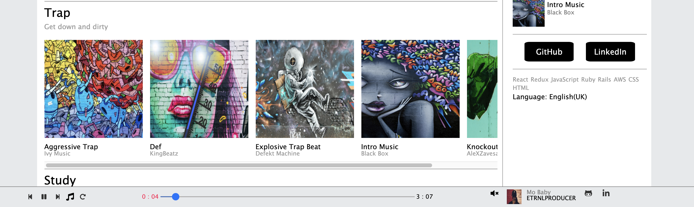

<h1 align = "center">Music</h1>
<p align = "center">

 </p>
 
# Table of Contents

1. [About Music Nimbus](#about)
2. [Technoloy Utilized](#tech)
3. [Continuous Play](#play)
4. [Related Code to Play](#playcode)
5. [User Upload](#upload)
6. [Related Code to Upload](#uploadcode)
 
## About Music Nimbus <a name="about"></a>

* Visit site [here](https://music-nimbus.herokuapp.com/#/)

<p>Music Nimbus is a clone of the music streaming service, Sound Cloud, with MusicNimbus you can discover and play a plethora of music to your liking! One core feature implemented in this project is the play bar that is rendered on the bottom of the screen whenever a song is played and continuously plays as the user navigates across the site.</p>

<p align = "center">
  
 </p>

## Technology Utilized <a name="tech"></a>

* React
* Rails
* Redux
* Amazon Web Services
* Javascript
* Ruby

## Continuous Play <a name="play"></a>

<p align "center">
  
 </p>

<p> Initially, there were some issues when I first implemented the SongPlayer Component. My initial approach was to import the SongPlayer in every component that a logged in user has access to. This apprach was a bit erroneous. The constant rerendering of the SongPlayer caused the unwanted side effect of stopping the music whenever a user navigated to a new section of the page. The solution to this dilemma was to have the SongPlayer Component live as a protected route that lives at the very top level of the application.</p>


## Related Code to Play <a name="playcode"></a>

```
const App = () => {

    return (
        <div className = "app">
            <Modal/>
            
            <ProtectedRoute path = "/" component={SongPlayerContainer} />
            <ProtectedRoute path = "/" component = {NavBarContainer} />
            
            <Switch>

           
                <AuthRoute exact path= "/" component={Splash}/>
                <ProtectedRoute path="/discover" component={Discover} />
                <ProtectedRoute path="/upload" component={UploadFormContainer} />
                <ProtectedRoute path="/users/:userId" component={UserShowContainer} />
                <ProtectedRoute path="/songs/:id" component={SongShowContainer} />
                
            </Switch> 

        </div>
    )
}

```
### Inside of Song Player Component
```
 componentDidUpdate(prevProps) {
        if (this.props.isPlaying) {
            let music = document.getElementById("music-source");
            music.play();
            this.updateCurrentTime()
        } if (this.props.currentSong) {
            if (!this.props.isPlaying) {
            let music = document.getElementById("music-source");
            music.pause();
            }
        }
    }
```

## User Upload <a name="upload"></a>

<p align "center">
  
 </p>

<p>The code for user upload follows standart CRUD functionality. The data that the user inputs is sent to the back end and cause a change in state. Preview is
available so users can pick the stylish images to accompany their songs.</p>

## Related Code to Upload <a name="uploadcode"></a>

```
   handleSubmit(e) {
        e.preventDefault();
        const formData = new FormData();
        formData.append('song[title]', this.state.title);
        formData.append('song[artist]', this.state.artist);
        formData.append('song[genre]', this.state.genre);
        formData.append('song[uploader_id]', this.props.currentUser.id);
        if (this.state.imageFile) {
            formData.append('song[image_file]', this.state.imageFile);
        }
        if (this.state.audioFile) {
            formData.append('song[audio_file]', this.state.audioFile);
        }
        this.props.createSong(formData).then(() => this.props.history.push('./discover'))
    }
```